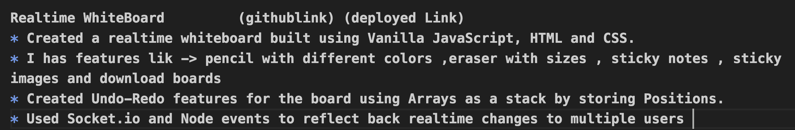

# Day-1
## Agenda
* Project Demo
* Template -> How to write about your project in your resume
* foundational knowledge 
* code the core logic of the project
* FAQ in your interviews

**Journey** -> 
  * 2 projects -> Resume write 
  * How write about that project
  * How to explain 
  * Questions -> Interviews 

**Projects**[4 classes -> 2 projects]
* `Real time Whiteboard`
  * Dev orientend
  * Realworld concepts
  * DSA -> stacks 
* `Excel clone` 
  * UI
  * DSA heavy project -> formula

**Pointers for adding Project in your Resume** 
* Crisp Explaination in pointer
* Github code 
* Deployed version

**Template for how to write about your Project**
* What is the Project , tech stack ??
* What are the features
* If there any special pointer
  

### facts
* Enviornment -> [features]  browser  -> document
* Logic -> Javascript [Engine] 

### References 
* Canvas : https://developer.mozilla.org/en-US/docs/Web/API/Canvas_API/Tutorial/Basic_usage
* Document : https://developer.mozilla.org/en-US/docs/Learn/JavaScript/Client-side_web_APIs/Manipulating_documents
* file : https://developer.mozilla.org/en-US/docs/Web/API/File/Using_files_from_web_applications#Example_Using_object_URLs_to_display_images
* Socketio : https://www.youtube.com/watch?v=8ARodQ4Wlf4

# Day-2 

## Agenda
* canvas API
* pencil -> color change
* eraser
* download 
* sticky
  * minimize , remove
  * movemement

## Facts
* Browser : document -> to represent our webpage
* Draw webpage -> browser  

# Day-3 
## agenda
* upload download
* redo , undo
* realtime upload 

## undo :
**Possibilities**
* canvas function -> ??->no
* you have implement your own logic
* while drawing -> store the point
* when you click on undo 
  * clearRect() -> clear
  * undo -> 
    * last point remove storage 
    * redraw
* 

## Browser
document
event listner
canvas
URL 

